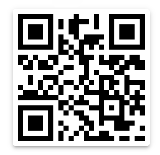

# Qrcode reading with Quirc example

In this examples, after a booting log, the example emits the qr-code read.
It uses the [quirc](https://github.com/dlbeer/quirc) libray [idf extra component](https://github.com/espressif/idf-extra-components/tree/master/quirc).

This example has been tested on an ESP-EYE with `OV3660` camera.

This repo is to show where the esp32-camera components stops to work as expected.


## How to run with devcontainer

Clone the repo with the recursive flag: `git clone --recursive https://github.com/FBEZ-forks/esp-eye-quirc-idf4.4.git`. Then:

0. (if not already included) Install wsl2, restart the computer
1. Install docker desktop
2. Install vscode
3. Open vscode, open the extension tab (ctrl+shift+x), find and install the "remote development" extension. Restart vscode
4. Open vscode, click ctrl+shift+p and start typing `Devcontainers: Rebuild and reopen in container`. Select it.

The first time it need to download and install some docker images. When finished, the terminal inside the vscode is run inside a "virtual machine" (container) with all the tools already install. 

You can now `cd esp-eye-quirc-idf4.4` and run `idf.py build`. 

Note: From inside the container is not easily possible to flash the firmware! You can check the last line from the compilation output 
e.g.
```
/opt/esp/python_env/idf4.4_py3.8_env/bin/python ../../opt/esp/idf/components/esptool_py/esptool/esptool.py -p (PORT) -b 460800 --before default_reset --after hard_reset --chip esp32  write_flash --flash_mode dio --flash_size detect --flash_freq 80m 0x1000 build/bootloader/bootloader.bin 0x8000 build/partition_table/partition-table.bin 0x10000 build/esp-eye-qrcode.bin
```

and use the same command entering the folder from the windows shell, if you have esptool installed:
e.g.
```
esptool.py -p (PORT) -b 460800 --before default_reset --after hard_reset --chip esp32  write_flash --flash_mode dio --flash_size detect --flash_freq 80m 0x1000 build/bootloader/bootloader.bin 0x8000 build/partition_table/partition-table.bin 0x10000 build/esp-eye-qrcode.bin
```

Otherwise you can flash using the flash tool with the files and offset mentioned in the line above. 


## Tested qr-code

The qr-code used to test the code is represented below.


## Tested ESP32-Camera commits

Tested commits of esp32-camera:
* `86a4951`: working  
* `d1c9c2c`: working

### Working log (86a4951)
```
I (875) app_peripherals: Camera module is ESP-EYE
I (875) gpio: GPIO[5]| InputEn: 1| OutputEn: 0| OpenDrain: 0| Pullup: 1| Pulldown: 0| Intr:2 
I (885) cam_hal: cam init ok
I (895) sccb: pin_sda 18 pin_scl 23
I (905) camera: Detected camera at address=0x3c
I (905) camera: Detected OV3660 camera
I (905) camera: Camera PID=0x3660 VER=0x00 MIDL=0x00 MIDH=0x00
I (1225) esp32 ll_cam: node_size: 3840, nodes_per_line: 1, lines_per_node: 4, dma_half_buffer_min:  3840, dma_half_buffer: 15360, lines_per_half_buffer: 16, dma_buffer_size: 30720, image_size: 57600
I (1225) cam_hal: buffer_size: 30720, half_buffer_size: 15360, node_buffer_size: 3840, node_cnt: 8, total_cnt: 3
I (1235) cam_hal: Allocating 57600 Byte frame buffer in PSRAM
I (1245) cam_hal: Allocating 57600 Byte frame buffer in PSRAM
I (1255) cam_hal: cam config ok
I (1265) ov3660: Calculated VCO: 160000000 Hz, PLLCLK: 160000000 Hz, SYSCLK: 40000000 Hz, PCLK: 10000000 Hz
0/1]Data: This is a test for esp32-camera
0/1] DECODE FAILED: Format data ECC failure
0/1]Data: This is a test for esp32-camera
0/1]Data: This is a test for esp32-camera
```

### Working (d1c9c2c - latest)
```
I (877) app_peripherals: Camera module is ESP-EYE
I (877) gpio: GPIO[5]| InputEn: 1| OutputEn: 0| OpenDrain: 0| Pullup: 1| Pulldown: 0| Intr:2   
I (887) cam_hal: cam init ok
I (897) sccb: pin_sda 18 pin_scl 23
I (897) sccb: sccb_i2c_port=1
I (907) camera: Detected camera at address=0x3c
I (907) camera: Detected OV3660 camera
I (907) camera: Camera PID=0x3660 VER=0x00 MIDL=0x00 MIDH=0x00
I (1227) esp32 ll_cam: node_size: 3840, nodes_per_line: 1, lines_per_node: 4, dma_half_buffer_min:  3840, dma_half_buffer: 15360,lines_per_half_buffer: 16, dma_buffer_size: 30720, image_size: 57600
I (1227) cam_hal: buffer_size: 30720, half_buffer_size: 15360, node_buffer_size: 3840, node_cnt: 8, total_cnt: 3
I (1237) cam_hal: Allocating 57600 Byte frame buffer in PSRAM
I (1247) cam_hal: Allocating 57600 Byte frame buffer in PSRAM
I (1257) cam_hal: cam config ok
I (1267) ov3660: Calculated VCO: 160000000 Hz, PLLCLK: 160000000 Hz, SYSCLK: 40000000 Hz, PCLK: 10000000 Hz
0/1] DECODE FAILED: ECC failure
0/1] DECODE FAILED: ECC failure
0/1] DECODE FAILED: ECC failure
0/1]Data: This is a test for esp32-camera
0/1]Data: This is a test for esp32-camera
```

with compilation warning about deprecation:
```
/project/main/app_peripherals.c: In function 'app_camera_init':
/project/main/app_peripherals.c:26:5: warning: 'pin_sscb_sda' is deprecated: please use pin_sccb_sda instead [-Wdeprecated-declarations]
     config.pin_sscb_sda = CAMERA_PIN_SIOD;
     ^~~~~~
In file included from /project/main/include/app_peripherals.h:8,
                 from /project/main/app_peripherals.c:1:
/project/components/esp32-camera/driver/include/esp_camera.h:123:13: note: declared here
         int pin_sscb_sda __attribute__((deprecated("please use pin_sccb_sda instead")));           /*!< GPIO pin for camera SDA line (legacy name) */
             ^~~~~~~~~~~~
/project/main/app_peripherals.c:27:5: warning: 'pin_sscb_scl' is deprecated: please use pin_sccb_scl instead [-Wdeprecated-declarations]
     config.pin_sscb_scl = CAMERA_PIN_SIOC;
     ^~~~~~
In file included from /project/main/include/app_peripherals.h:8,
                 from /project/main/app_peripherals.c:1:
/project/components/esp32-camera/driver/include/esp_camera.h:127:13: note: declared here
         int pin_sscb_scl __attribute__((deprecated("please use pin_sccb_scl instead")));           /*!< GPIO pin for camera SCL line (legacy name) */
             ^~~~~~~~~~~~
```

But once changed as mentioned, everything works fine also in compilation. 

## Notes

Please note that there is a minimum distance at which the camera can focus on the qr code. This also put a limit to the minimum side of the qr code. If the qr code is nearer than 5 to 6 cm, it may be necessary to put an additional lens (crf. reference nr. 1).

In the table below are recorded a few couples of lens distance and qr-code side size.  

| Qr-code side length (cm) | Approx. Lens distance (cm) |
|---|---|
|6.5 | 17 |
|4 | 3| 
|2.5|6|


## References

+ [Minimum lens distance thread](https://electronics.stackexchange.com/questions/458332/shortest-focus-distance-of-ov2640-camera-modules-with-fixed-focus)
+ [Original esp-who example](https://github.com/espressif/esp-who/tree/master/examples/code_recognition)
